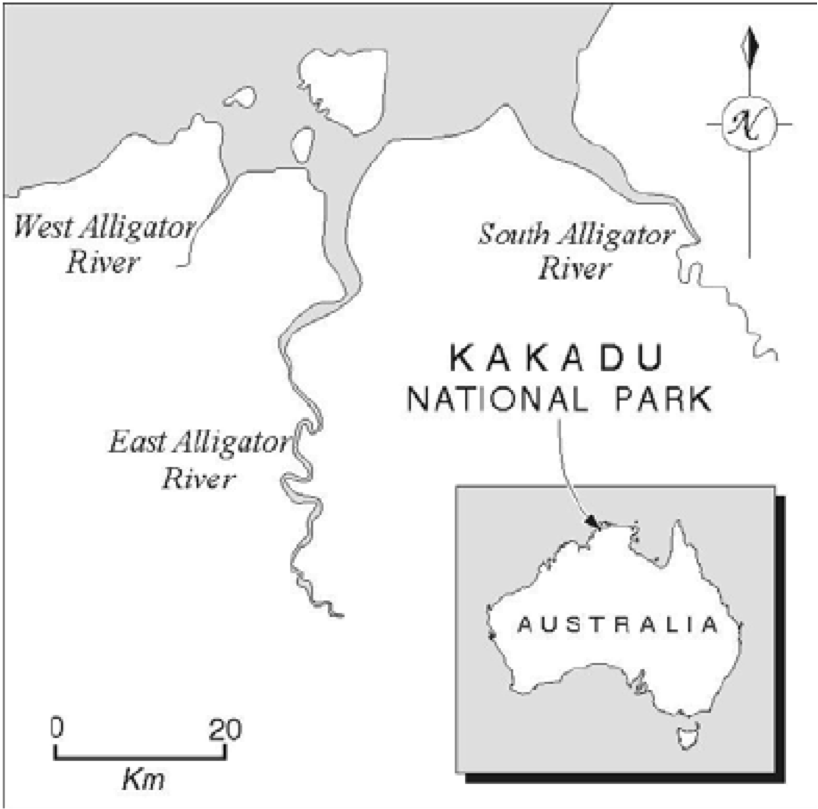

```{r setup, include=FALSE}
knitr::opts_chunk$set(echo = FALSE, message = FALSE, 
                      warning = FALSE, dpi = 600)
```

```{r initial_data_cleanup, include=FALSE, echo=FALSE}
## this is the code for cleaning the data set
library(tidyverse)
library(lubridate)
library(stringr)
library(rgdal)
library(sp)
library(maptools)
library(ggmap)
library(sp)

# guess_max set because otherwise R sets up the variables incorrectly
aussie_data <- read_csv("data_raw/mmc1.csv", guess_max = 5000)

# initial bits of cleanup
# dropping some non-useful columns - leaves 5060 obs. of 53 variables
clean_aussie_data <- dplyr::select(aussie_data, -`Database ID`, `Composite count`, -`Family code`, -Datum, -Notes, -Reference, -Geocoding, 
                            -(contains("err")), -`Mussel age (y)`)

# renaming some columns to simplify R codes
# deliberately left bare element names capitalized, but shifted isotope names
clean_aussie_data <- clean_aussie_data %>%
  dplyr::rename(sample_id = `Sample ID`, ecosystem = Ecosystem, 
                sample_type = `Sample type`, common_name = `Common name`,
                sci_name = `Scientific name`, bush_group = `Bush food group`,
                wildlife_group = `Wildlife group`, compartment = Compartment,
                composite_count = `Composite count`, sex = Sex, 
                soil_depth = `Soil depth (cm)`, 
                collection_date = `Collection date (day/month/year)`, 
                location = Location, status = Status, easting = Easting,
                northing = Northing, zone = Zone, u238 = `U-238`, 
                u234 = `U-234`, th230 = `Th-230`, ra226 = `Ra-226`, 
                pb210 = `Pb-210`, po210 = `Po-210`, th232 = `Th-232`, 
                ra228 = `Ra-228`, th228 = `Th-228`, ac227 = `Ac-227`, 
                k40 = `K-40`, dry_mass_fraction = `Dry mass fraction`)
#
# original dataset uses wildlife_group only for a fine-grained division of 
# plant and animal samples.  Here we use ecosystem and sample_type to create 
# entries in wildlife_group for soil and sediment samples, as well as for
# fruits that were not counted in other types. Set the wildlife_group to a 
# factor.
clean_aussie_data <- clean_aussie_data %>%
  dplyr::mutate(wildlife_group = ifelse(is.na(wildlife_group), 
                paste0(ecosystem,"-",sample_type), wildlife_group ))
#
# set several values to factors: ecosystem, sample_type, wildlife_group
# convert collection_date to a date
clean_aussie_data$wildlife_group <- as.factor(clean_aussie_data$wildlife_group)
clean_aussie_data$ecosystem <- as.factor(clean_aussie_data$ecosystem)
clean_aussie_data$sample_type <- as.factor(clean_aussie_data$sample_type)
clean_aussie_data$collection_date <- dmy(clean_aussie_data$collection_date)
#
# entries in sample_id are not unique, so create an entry number for later use
clean_aussie_data$entry_num <- 1:nrow(clean_aussie_data)
#
# A number of sample results were reported as below detection limits, in the form
# of "<value", where value is the detection limit.  Highly conservative to
# use the LOD as the value but what we elected to do
clean_aussie_data <- clean_aussie_data %>%
  mutate(u234 = as.numeric(str_replace(u234, "<", "")),
         th230 = as.numeric(str_replace(th230, "<", "")),
         ra226 = as.numeric(str_replace(ra226, "<", "")),
         pb210 = as.numeric(str_replace(pb210, "<", "")),
         th232 = as.numeric(str_replace(th232, "<", "")),
         po210 = as.numeric(str_replace(po210, "<", "")),
         k40 = as.numeric(str_replace(k40, "<", "")),
         u238 = as.numeric(str_replace(u238, "<", "")),
         ra228 = as.numeric(str_replace(ra228, "<", "")),
         th228 = as.numeric(str_replace(th228, "<", "")),
         Al = as.numeric(str_replace(Al, "<", "")),
         As = as.numeric(str_replace(As, "<", "")),
         Ba = as.numeric(str_replace(Ba, "<", "")),
         Ca = as.numeric(str_replace(Ca, "<", "")),
         Cd = as.numeric(str_replace(Cd, "<", "")),
         Co = as.numeric(str_replace(Co, "<", "")),
         Cr = as.numeric(str_replace(Cr, "<", "")),
         Cu = as.numeric(str_replace(Cu, "<", "")),
         Fe = as.numeric(str_replace(Fe, "<", "")),
         Hg = as.numeric(str_replace(Hg, "<", "")),
         K = as.numeric(str_replace(K, "<", "")),
         Mg = as.numeric(str_replace(Mg, "<", "")),
         Mn = as.numeric(str_replace(Mn, "<", "")),
         Na = as.numeric(str_replace(Na, "<", "")),
         Ni = as.numeric(str_replace(Ni, "<", "")),
         P = as.numeric(str_replace(P, "<", "")),
         Pb = as.numeric(str_replace(Pb, "<", "")),
         Rb = as.numeric(str_replace(Rb, "<", "")),
         S = as.numeric(str_replace(S, "<", "")),
         Sb = as.numeric(str_replace(Sb, "<", "")),
         Se = as.numeric(str_replace(Se, "<", "")),
         Th = as.numeric(str_replace(Th, "<", "")),
         U = as.numeric(str_replace(U, "<", "")),
         V = as.numeric(str_replace(V, "<", "")),
         Zn = as.numeric(str_replace(Zn, "<", ""))
         )
emitters <- c("u238", "u234", "th230", "ra226", "pb210", "po210", "th232",
                    "ra228", "th228", "ac227", "k40")
clean_aussie_data$radionuclides <- rowSums(clean_aussie_data[, emitters], 
                                           na.rm = TRUE)
#
# consolidate the wildlife_group factors into sample_type
clean_aussie_data <- clean_aussie_data%>% 
  mutate(sample_type = case_when(
    clean_aussie_data$wildlife_group == "Terrestrial-Bird" ~ 
      "Terrestrial Animals",
    clean_aussie_data$wildlife_group == "Terrestrial-Reptile" ~ 
      "Terrestrial Animals",
    clean_aussie_data$wildlife_group == "Terrestrial-Mammal" ~ 
      "Terrestrial Animals",
    clean_aussie_data$wildlife_group == "Terrestrial-Grasses and Herbs" ~
      "Terrestrial Plants",
    clean_aussie_data$wildlife_group == "Terrestrial-Plant" ~ 
      "Terrestrial Plants",
    clean_aussie_data$wildlife_group == "Terrestrial-Soil" ~ 
      "Terrestrial Soil",
    clean_aussie_data$wildlife_group == "Freshwater-Bird" ~ 
      "Freshwater Animals",
    clean_aussie_data$wildlife_group == "Freshwater-Reptile" ~ 
      "Freshwater Animals",
    clean_aussie_data$wildlife_group == "Freshwater-Fish" ~ "Fish",
    clean_aussie_data$wildlife_group == "Freshwater-Mollusc" ~ "Mollusc",
    clean_aussie_data$wildlife_group == "Freshwater-Sediment" ~ 
      "Freshwater Sediment",
    clean_aussie_data$wildlife_group == "Freshwater-Vascular Plant" ~ 
      "Freshwater Plant",
    clean_aussie_data$wildlife_group == "Freshwater-Water" ~ "Water",
    TRUE ~ "NA"))
# 
# peeling out the geospatial information for plotting
#geo_data <- select(clean_aussie_data, sample_id, easting, northing, zone)
# filter out a few NAs
geo_data <- subset(clean_aussie_data, easting != "" | northing != "")
#
# the geo_data is in UTM coordinates, need to convert to lat-long
# the lat-long conversion requires that the data be split between the UTM
# zones.  In this case, 52S and 53S.  From here on everything is split.
geo_data_52 <- subset(geo_data, zone == "52S")
geo_data_53 <- subset(geo_data, zone == "53S")
coords_52 <- cbind(Easting = as.numeric(as.character(geo_data_52$easting)),
                   Northing = as.numeric(as.character(geo_data_52$northing)))
coords_53 <- cbind(Easting = as.numeric(as.character(geo_data_53$easting)),
                   Northing = as.numeric(as.character(geo_data_53$northing)))
#
# Create the SpatialPointsDataFrame
spatial_52 <- SpatialPointsDataFrame(coords_52, data = 
                    data.frame(geo_data_52$entry_num), 
                    proj4string = CRS("+init=epsg:32752"))
spatial_53 <- SpatialPointsDataFrame(coords_53, data = 
                    data.frame(geo_data_53$entry_num), 
                    proj4string = CRS("+init=epsg:32753"))
#
# Convert to Lat Long
# Convert from Eastings and Northings to Latitude and Longitude
spatial_52_ll <- spTransform(spatial_52, CRS("+init=epsg:4326"))
spatial_53_ll <- spTransform(spatial_53, CRS("+init=epsg:4326"))
#
# we also need to rename the columns 
colnames(spatial_52_ll@coords)[colnames(spatial_52_ll@coords) == 
                                 "Easting"]<- "Longitude" 
colnames(spatial_52_ll@coords)[colnames(spatial_52_ll@coords) == 
                                 "Northing"]<- "Latitude"
colnames(spatial_53_ll@coords)[colnames(spatial_53_ll@coords) == 
                                 "Easting"]<- "Longitude" 
colnames(spatial_53_ll@coords)[colnames(spatial_53_ll@coords) == 
                                 "Northing"]<- "Latitude"
#
# convert back to data frames
geo_data_52_ll <- as.data.frame(spatial_52_ll)
geo_data_52_ll <- dplyr::rename(geo_data_52_ll, 
                                entry_num = geo_data_52.entry_num)
geo_data_53_ll <- as.data.frame(spatial_53_ll)
geo_data_53_ll <- dplyr::rename(geo_data_53_ll, 
                                entry_num = geo_data_53.entry_num)
#
# merge the two lat-long data sets into one, then join back into original
# cleaned data set, producing a new data frame
geo_data_ll <- rbind(geo_data_52_ll, geo_data_53_ll)
geo_aussie_data <- left_join(geo_data_ll, clean_aussie_data, by = "entry_num")
#
# the final clean dataset here is geo_aussie_data
```

## Research Questions:
* Have mining and milling operations at the Ranger Mine contaminated the surrounding Alligators River Region with radionuclides and metals?
    + Where are the sample types of interest located in relation to the mine?
    + How do the concentrations of radionuclides and metals change with distance from the mine?

##Problem
The Alligator Rivers Region is a province in the wet-dry tropics of northeastern Australia. The land in this region is rich in uranium, and since 1980 has been home to a large mine. [This is the Ranger Uranium mine](http://www.world-nuclear.org/information-library/country-profiles/countries-a-f/appendices/australia-s-uranium-mines.aspx#ranger):


An Australian government entity called the [Environmental Research Institute of the Supervising Scientist](http://www.environment.gov.au/science/supervising-scientist) (ERISS) has been collecting animal and environmental samples from the land around the mine, in the general area of the Alligator Rivers Watershed and Kakadu National Park:


These have been collected since mine activity began. The samples have been measured for many different mine contaminants including the heavy metals Copper (Cu), Arsenic (As), Lead (Pb), Mercury (Hg), isotopes of Uranium (U), Thorium (Th), Radium (Ra), Polonium (Po), Actinium (Ac), and Potassium (K) - specifically ^234^U, ^238^U, ^230^Th, ^232^Th, ^226^Ra, ^228^Ra, ^210^Pb, ^210^Po, ^228^Th, ^227^Ac, and ^40^K.  All of these metals and radionuclides are naturally occurring, but may have been released during mining and milling at the mine.

Radionuclide information is measured using the SI unit of activity, the Becquerel (Bq).  This unit is defined as one radioactive decay or disintegration per second.

The location of the mine and the surrounding region is show below. Locations of sample collection are indicated.

```{r largemap, fig.align = 'center', echo = FALSE, fig.width = 4, dpi = 600}

northern_terr <- get_map("Jabiru", zoom = 7,
                     source = "google", maptype = "hybrid")
ranger_location <- tibble(long = 132.9107, lat = -12.6848)
temp_data <- filter(geo_aussie_data, !(sample_type=="NA"))
map_large <- ggmap(northern_terr, extent = "device") +
    geom_point(data = temp_data, aes(x = Longitude, y = Latitude), 
             size = .5, color = "red")+
    geom_point(data = ranger_location, aes(x = long, y = lat), 
               size = 1.5, color = "green") +
    geom_text(data = ranger_location, aes(x = long, y = lat,label = "Ranger Mine"),
          colour = "white", size = 4, hjust = 1, vjust = 1) +
    ggtitle("Sample Points in the Vicinity of the Ranger Mine")
map_large
```

Samples from flora, fauna, and soil and water have been gathered by the ERISS. The specific sample types can be clustered based on their ecological niche and purpose in the watershed, to contain the following groups: water, fish, molluscs, freshwater animals, freshwater plants, freshwater sediment, terrestrial animals, terrestrial plants, and terrestrial soil. The following map shows the collection locations of these varying sample types, near the Ranger Mine.

```{r smallmap, fig.align = 'center', echo = FALSE, fig.width = 7, dpi = 600}
northern_terr_zoomed <- get_map("Jabiru", zoom = 9,
                         source = "google", maptype = "hybrid", color = "bw")
ranger_location <- tibble(long = 132.9107, lat = -12.6848)
temp_data <- filter(geo_aussie_data, !(sample_type=="NA"))
map_small <- ggmap(northern_terr_zoomed, extent = "device") +
  geom_point(data = temp_data, aes(x = Longitude, y = Latitude, 
             color = sample_type), size = .6, position = "jitter")+
  geom_point(data = ranger_location, aes(x = long, y = lat), 
             size = 3, color = "White", shape = 18) +
  geom_text(data = ranger_location, aes(x = long, y = lat, 
             label = "Ranger Mine"),
            colour = "white", size = 4, hjust = 1, vjust = 1) +
  scale_color_brewer(palette = "Spectral", name = "Sample Substrate" ) +
  ggtitle("Sample Points by Substrate \nin the Vicinity of the Ranger Mine") +
  theme(plot.title = element_text(size = 8), 
        legend.title = element_text(size = 8),
        legend.text = element_text(size = 7))
map_small
```

This dataset of environmental samples has been continually gathered by the ERISS to keep track of mine contaminants in the region over space and time. The dataset was recently published in the [Journal of Environmental Radioactivity](http://www.sciencedirect.com/science/article/pii/S0265931X16301928). 

Attempting to answer the research questions proposed, using this dataset, is important for many reasons. One reason is to better understand the overall impacts of uranium mining on water and fauna, as 1/3 of the land in the region forms the Kakadu National Park.  Addtionally, most of the remaining land is aboriginally owned. Because of this ownership, there are concerns about the contamination of bush foods, and also the contamination of flora for wild animal consumption.  After mine closure, the site is to be remediated by 2026 and incorporated into Kakadu. Knowing where and to what level contaminants can be found is also central to this ultimate goal. 

##Analysis
The initial dataset was made available as an .xlsx file.  The only manual process was to load the file into Excel and save as a .csv file; all other data cleaning was performed using an R script.  Most of the data cleanup consisted of cosmetic and convenience changes, renaming variables and setting data types.  We created a variable called ```sample_type``` to group samples by substrate, such as Terrestrial Plants or Fish.  This is important for both our analysis and for the Shiny app.

The dataset includes geospatial data using Easting and Northing in two different zones of a Mercator Projection.  We used functions from the ```rgdal``` and ```sp``` packages to convert to lat-long coordinates, which we were then able to plot using ```ggplot2```.  

A number of sample results were reported as below detection limits, in the form of "<value", where value is the detection limit rather than an actual measured value.  We discussed several possibilities for managing these results.  We found references that directly used the LOD as a result (highly conservative), that used 0 as the result (effectively loses results), or divided the LOD by a factor (2 or $\sqrt{2}$) for use as a result (could be considered arbitary).  We elected to go the highly conservative route and use the LOD as the value. 


##Results
```{r plotting_prep}
library(broom)
library(foreign)
library(leaflet)
library(geosphere)

# Preston's distance script 
# straight-line distance from the mine at (132.9107, -12.6848)
Distance <- vector(, nrow(geo_aussie_data))
for(i in 1:nrow(geo_aussie_data)){
  Distance[i] = distm(c(geo_aussie_data$Longitude[i], 
                        geo_aussie_data$Latitude[i]), 
                        c( 132.9107,-12.6848), fun = distHaversine)
}
geo_aussie_data<-mutate(geo_aussie_data, Distance = Distance)
```

Below are the results for the radionuclide concentration (Bq/Kg) in Molluscs as a function of the year sampled. The color of each point is scaled by it's proximity to the mine. 

```{r Mollusc,fig.align='center', echo=FALSE, fig.width=7, dpi=600}
###Mollusc Concentration of Radionuclides over time
Mollusc_Rad_vs_Time <- filter(geo_aussie_data, sample_type == "Mollusc")
Mollusc_Rad_vs_Time <- mutate(Mollusc_Rad_vs_Time, 
                              sample_year = year(collection_date))
Mollusc_Rad_vs_Time <- arrange(Mollusc_Rad_vs_Time, sample_year)
Mollusc <- ggplot(data = Mollusc_Rad_vs_Time) + 
  geom_point(aes(x = sample_year, y = radionuclides, color = Distance/1000),
             alpha=.8) +
  scale_fill_brewer() +
  xlab("Sample Year") + ylab("Radionuclide Concentration (Bq/kg)") +
  ggtitle("Radionuclide Concentration \n in Molluscs vs. Time") + 
  labs(color = "Distance (km)") +
  theme_bw()

Mollusc
```

If the presence of the mine had a direct impact on the radionuclide concentrations in the environment, one would expect to see concentrations of radionuclides increase over time, from the point before the mine was established to after. However, there is no apparent data to indicate an upward trend in radionuclide concentration over time, nor does the radionuclide concentration seem to depend on distance for a particular year. 

The fluctuations in radionuclide content are most likely caused by naturally occuring radionuclides within the local geology, as molluscs spend their lives embedded in the land! There has been a presence of these entities in the sampled environments, preceding any excavation from the mine. 

As water is fluid (PUN!) in this area, unlike the land or relatively static molluscs, we can look specifically at the content of radionuclides in the water samples taken over time.

```{r Rad_vs._Distance,echo=FALSE, fig.width=7, fig.align='center'}
##Water Radiation Concentration as a function of distance (7,000m)
Water_Rad_vs_Dis <- arrange(geo_aussie_data, Distance)
Water_Rad_vs_Dis <- filter(geo_aussie_data, Distance < 10000)
Water_Rad_vs_Dis <- filter(Water_Rad_vs_Dis, sample_type == "Water")
Rad_Close <- ggplot(data = Water_Rad_vs_Dis, aes(x = (Distance/1000),
                                                 y = radionuclides)) + 
  geom_point(color = "blue", alpha = .8) +
  xlab("Distance (kilometers)") + 
  ylab("Radionuclide Concentration (Bq/l)") + 
  xlim(0,7) +
  ggtitle("Radionuclide Concentration \n in Water vs. Distance")
Rad_Close
```

As one can see, there is a slight downward trend in the amount of radionuclides in water samples as are taken farther and farther from the mine. The water samples represented in the graph above reflect those taken from all sampled years.  


```{r Heavy_Metal, fig.align='center', echo=FALSE, fig.width=7}
### Sediment Heavy Metal Concentration
Sed_Met_vs_Dis <- arrange(geo_aussie_data, Distance)
Sed_Met_vs_Dis <- filter(Sed_Met_vs_Dis, sample_type == "Freshwater Sediment")
Sed_Met_vs_Dis <- filter(geo_aussie_data, Distance < 10000)
Heavy_Metal <- ggplot(data = Sed_Met_vs_Dis) + 
  geom_point(aes(x = Distance/1000, y = Pb, color = "Pb"))+
  geom_point(aes(x = Distance/1000, y = Cu, color = "Cu"))+
  geom_point(aes(x = Distance/1000, y = As, color = "As"))+
  geom_point(aes(x = Distance/1000, y = Hg, color = "Hg"))+
  xlab("Distance (kilometers)") +
  ylab("Heavy Metal Concentration (mg/l)") +
  ggtitle("Metal Concentration \n in Water vs. Distance") +
  scale_colour_manual(name = 'Heavy Metal', 
          values = c('Pb'='green','Cu'='red','As'='black','Hg'='blue'),
          labels=c('Pb','Cu','As','Hg'))

Heavy_Metal
```

The figure above shows metal concentrations in water samples as a function of distance from the mine.  Both copper and lead show a potentially significant correlation with distance; mercury may as well.  This figure also shows one side effect of our decision to treat results below the limits of detection as results equal to the limit of detection; a common detection threshold for lead was ~25 mg/l.

##Further Research
While the dataset is quite robust in general, there are some limitations.  For example, there are very few samples of insects available.  For locations more than a few kilometers from the mine, there are not many repeat samples such that a time course could be studied.  Since the primary focus was environmental samples, there does not appear to have been a concerted effort conducted to study animals and their uptake of heavy metals and radionuclides.

Interestingly, the same group that published the initial data set recently published a short communication entitled '[A tool for calculating concentration ratios from large environmental data sets](https://www.ncbi.nlm.nih.gov/pubmed/27579895). This publication outlines a tool developed in MS Excel that predicts biological accumulation of mine contaminants, given their proximity to environmental samples with certain concentrations of both metals and radionuclides. We'd expect others to start analyzing this current data set in light of this newly developed tool, since these many environmental measures can now been linked to biological outcomes.
